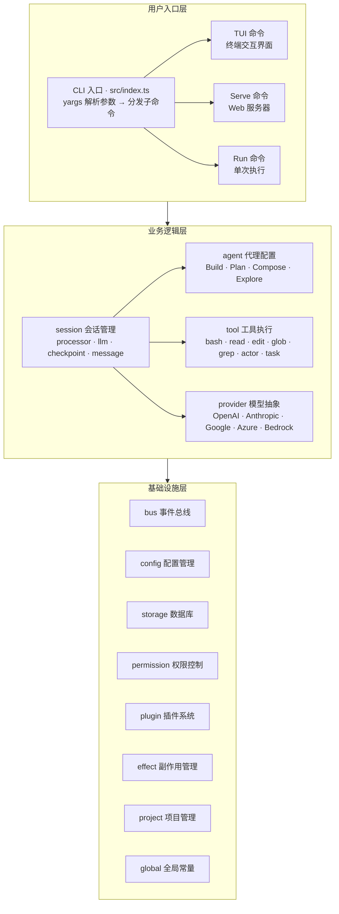
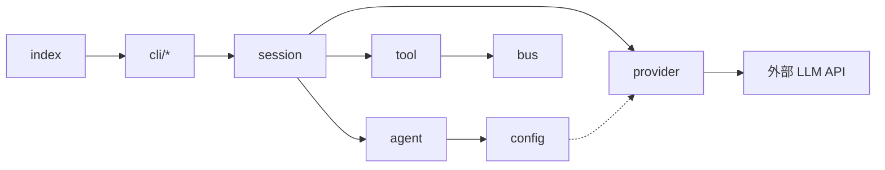
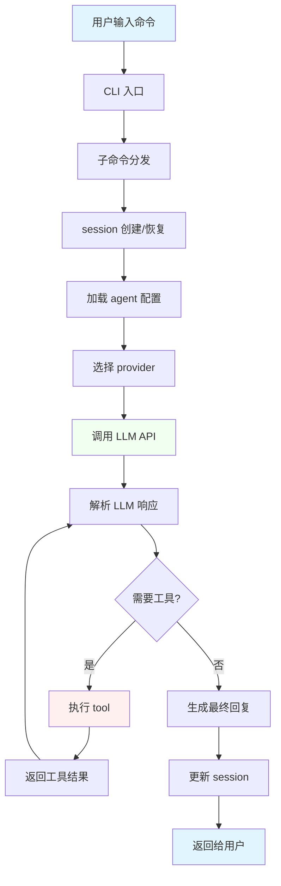
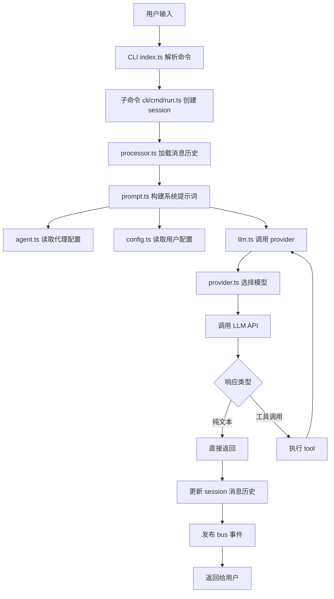
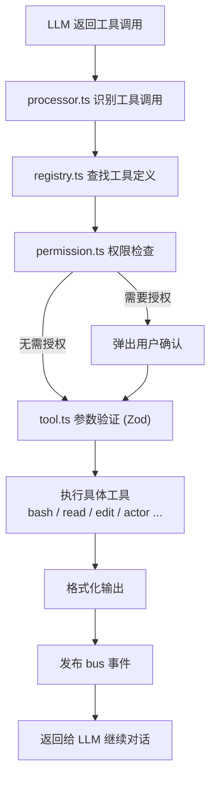

# MiMoCode 架构图

## 系统分层架构

整体分为三层:**用户入口层**负责命令解析与分发,**业务逻辑层**承载会话/代理/工具/模型调用的核心流程,**基础设施层**提供事件、配置、存储等通用能力。



## 依赖方向说明

箭头表示「依赖 / 调用」,整体自上而下单向依赖,不反向依赖;模块间通过 `bus` 事件总线解耦。



关键依赖关系:

- `session` 依赖 `agent`(读取代理配置)、`provider`(调用 LLM)、`tool`(执行工具)
- `agent` 依赖 `config`(读取配置)
- `tool` 依赖 `bus`(发布事件)
- `provider` 依赖外部 LLM API

## 核心调用链路



## 模块职责表

| 模块 | 入口文件 | 核心职责 | 关键依赖 |
|------|----------|----------|----------|
| **session** | `src/session/session.ts` | 会话生命周期、消息管理、上下文窗口 | agent, provider, tool, bus, storage |
| **agent** | `src/agent/agent.ts` | 代理角色定义、权限配置、提示词管理 | config, provider |
| **tool** | `src/tool/registry.ts` | 工具注册、执行、结果格式化 | session, agent, bus, permission |
| **provider** | `src/provider/provider.ts` | LLM 调用抽象、模型管理、响应转换 | config, auth, plugin |
| **bus** | `src/bus/index.ts` | 事件发布/订阅、模块间解耦通信 | - |
| **config** | `src/config/config.ts` | 配置读取、层次合并、动态更新 | global |
| **storage** | `src/storage/db.bun.ts` | SQLite 数据库、Drizzle ORM、迁移 | - |
| **permission** | `src/permission/index.ts` | 工具执行权限控制、用户授权 | config |

## 详细调用流程

### 用户发送消息到 LLM 响应



### 工具执行流程



## 技术栈

- **运行时:** Bun
- **语言:** TypeScript
- **数据库:** SQLite (Drizzle ORM)
- **框架:** Effect (副作用管理)
- **UI:** SolidJS — 终端 TUI 经 OpenTUI 渲染,Web 端经 DOM 渲染;服务端 Hono
- **包管理:** Bun workspace

## 目录结构

```
packages/opencode/
├── src/
│   ├── index.ts           # CLI 入口
│   ├── cli/               # 命令定义
│   │   └── cmd/           # 各子命令(含 tui/ 终端界面)
│   ├── session/           # 会话管理(核心)
│   ├── agent/             # 代理配置
│   ├── tool/              # 工具系统
│   ├── provider/          # LLM 提供商
│   ├── config/            # 配置管理
│   ├── storage/           # 数据库
│   ├── bus/               # 事件总线
│   ├── permission/        # 权限控制
│   ├── plugin/            # 插件系统
│   ├── project/           # 项目管理
│   └── util/              # 工具函数
├── migration/             # 数据库迁移
└── test/                  # 测试
```

## 关键设计模式

### 1. 分层架构

- **用户入口层:** CLI 解析、命令分发
- **业务逻辑层:** session / agent / tool / provider
- **基础设施层:** bus / config / storage / permission

### 2. 依赖方向

- 上层依赖下层,不反向依赖
- 通过 bus 事件总线实现松耦合
- 通过 Effect 管理副作用

### 3. 模块职责单一

- session:会话生命周期管理
- agent:代理配置和角色定义
- tool:工具注册和执行
- provider:LLM 调用抽象

## 扩展点

1. **自定义工具:** 实现 `Tool.Def` 接口,注册到 `registry.ts`
2. **自定义代理:** 配置代理角色和提示词
3. **MCP 服务器:** 集成外部工具和服务
4. **插件系统:** 通过 `@mimo-ai/plugin` 扩展
5. **提供商:** 添加新的 LLM 提供商
