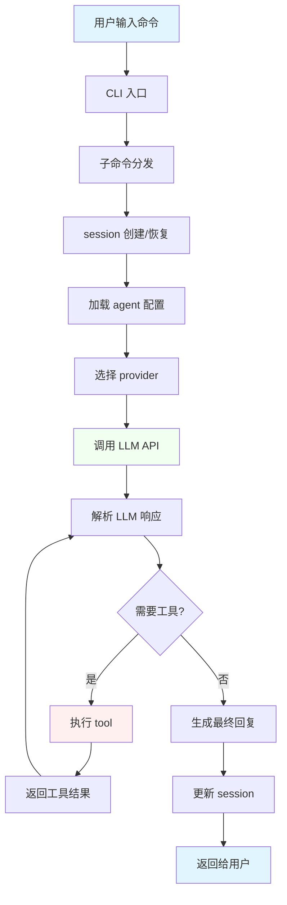

# MiMoCode 架构图

## 系统分层架构

```
┌─────────────────────────────────────────────────────────────────────────────────┐
│                                   用户入口层                                    │
│  ┌───────────────────────────────────────────────────────────────────────────┐  │
│  │  CLI 入口 (src/index.ts)                                                  │  │
│  │  └─ yargs 解析命令行参数 → 分发到子命令 (src/cli/cmd/*)                    │  │
│  └───────────────────────────────────────────────────────────────────────────┘  │
│                          │                                                      │
│                          ▼                                                      │
│  ┌─────────────────────┬─────────────────────┬────────────────────────────────┐ │
│  │  TUI 命令           │  Serve 命令         │  Run 命令                      │ │
│  │  (终端交互界面)     │  (Web 服务器)       │  (单次执行)                    │ │
│  └─────────────────────┴─────────────────────┴────────────────────────────────┘ │
└─────────────────────────────────────────────────────────────────────────────────┘
                                          │
                                          ▼
┌─────────────────────────────────────────────────────────────────────────────────┐
│                                  业务逻辑层                                      │
│                                                                                 │
│  ┌───────────────────────────────────────────────────────────────────────────┐  │
│  │  session (会话管理) - src/session/                                        │  │
│  │  ┌─────────────┐  ┌─────────────┐  ┌─────────────┐  ┌─────────────┐     │  │
│  │  │ processor   │  │    llm      │  │  checkpoint │  │   message   │     │  │
│  │  │ (消息处理)  │  │ (LLM 调用)  │  │ (检查点)    │  │ (消息格式)  │     │  │
│  │  └─────────────┘  └─────────────┘  └─────────────┘  └─────────────┘     │  │
│  └───────────────────────────────────────────────────────────────────────────┘  │
│                          │                    │                                 │
│                          ▼                    ▼                                 │
│  ┌───────────────────────────────────────────────────────────────────────────┐  │
│  │  agent (代理配置) - src/agent/                                            │  │
│  │  ┌─────────────────────────────────────────────────────────────────────┐  │  │
│  │  │  agent.ts - 定义代理角色、权限、提示词                               │  │  │
│  │  │  ┌───────────┐  ┌───────────┐  ┌───────────┐  ┌───────────┐        │  │  │
│  │  │  │  Build    │  │   Plan    │  │  Compose  │  │  Explore  │        │  │  │
│  │  │  │ (直接执行)│  │ (只读规划)│  │ (协调技能)│  │ (代码探索)│        │  │  │
│  │  │  └───────────┘  └───────────┘  └───────────┘  └───────────┘        │  │  │
│  │  └─────────────────────────────────────────────────────────────────────┘  │  │
│  └───────────────────────────────────────────────────────────────────────────┘  │
│                          │                                                      │
│                          ▼                                                      │
│  ┌───────────────────────────────────────────────────────────────────────────┐  │
│  │  tool (工具执行) - src/tool/                                              │  │
│  │  ┌─────────────────────────────────────────────────────────────────────┐  │  │
│  │  │  registry.ts - 工具注册中心，管理所有可用工具                         │  │  │
│  │  │  ┌──────┐ ┌──────┐ ┌──────┐ ┌──────┐ ┌──────┐ ┌──────┐ ┌──────┐   │  │  │
│  │  │  │ bash │ │ read │ │ edit │ │ glob │ │ grep │ │ actor│ │ task │   │  │  │
│  │  │  └──────┘ └──────┘ └──────┘ └──────┘ └──────┘ └──────┘ └──────┘   │  │  │
│  │  └─────────────────────────────────────────────────────────────────────┘  │  │
│  └───────────────────────────────────────────────────────────────────────────┘  │
│                          │                                                      │
│                          ▼                                                      │
│  ┌───────────────────────────────────────────────────────────────────────────┐  │
│  │  provider (LLM 提供商) - src/provider/                                    │  │
│  │  ┌─────────────────────────────────────────────────────────────────────┐  │  │
│  │  │  provider.ts - 抽象层，统一调用不同 LLM                              │  │  │
│  │  │  ┌─────────┐ ┌─────────┐ ┌─────────┐ ┌─────────┐ ┌─────────┐       │  │  │
│  │  │  │ OpenAI  │ │Anthropic│ │ Google  │ │ Azure   │ │ Bedrock │       │  │  │
│  │  │  └─────────┘ └─────────┘ └─────────┘ └─────────┘ └─────────┘       │  │  │
│  │  └─────────────────────────────────────────────────────────────────────┘  │  │
│  └───────────────────────────────────────────────────────────────────────────┘  │
└─────────────────────────────────────────────────────────────────────────────────┘
                                          │
                                          ▼
┌─────────────────────────────────────────────────────────────────────────────────┐
│                                  基础设施层                                      │
│                                                                                 │
│  ┌─────────────┐  ┌─────────────┐  ┌─────────────┐  ┌─────────────┐            │
│  │    bus      │  │   config    │  │   storage   │  │  permission │            │
│  │  (事件总线) │  │  (配置管理) │  │  (数据库)   │  │  (权限控制) │            │
│  └─────────────┘  └─────────────┘  └─────────────┘  └─────────────┘            │
│                                                                                 │
│  ┌─────────────┐  ┌─────────────┐  ┌─────────────┐  ┌─────────────┐            │
│  │   plugin    │  │   effect    │  │   project   │  │   global    │            │
│  │  (插件系统) │  │ (副作用管理)│  │  (项目管理) │  │  (全局常量) │            │
│  └─────────────┘  └─────────────┘  └─────────────┘  └─────────────┘            │
└─────────────────────────────────────────────────────────────────────────────────┘
```

## 依赖方向说明

```
用户入口层 ──────────────────────────────────────────────────────────────────────▶ 业务逻辑层
     │                                                                                │
     │                                                                                │
     │  index.ts 只依赖 cli/cmd/*                                                     │
     │  子命令调用 session/agent                                                      │
     │                                                                                │
     ▼                                                                                ▼
┌─────────┐      ┌─────────┐      ┌─────────┐      ┌─────────┐                 ┌─────────┐
│  index  │─────▶│  cli/*  │─────▶│ session │─────▶│  agent  │                 │  tool   │
└─────────┘      └─────────┘      └────┬────┘      └────┬────┘                 └────┬────┘
                                       │                │                            │
                                       │                │                            │
                                       ▼                ▼                            ▼
                                  ┌─────────┐      ┌─────────┐                 ┌─────────┐
                                  │provider │◀─────│ config  │                 │  bus    │
                                  └────┬────┘      └─────────┘                 └─────────┘
                                       │
                                       ▼
                                  ┌─────────┐
                                  │   LLM   │
                                  └─────────┘

依赖方向：
  ──▶ 表示 "依赖" 或 "调用"
  session 依赖 agent (读取代理配置)
  session 依赖 provider (调用 LLM)
  session 依赖 tool (执行工具)
  agent 依赖 config (读取配置)
  tool 依赖 bus (发布事件)
  provider 依赖外部 LLM API
```

## 核心调用链路



## 模块职责表

| 模块 | 入口文件 | 核心职责 | 关键依赖 |
|------|----------|----------|----------|
| **session** | `src/session/session.ts` | 会话生命周期、消息管理、上下文窗口 | agent, provider, tool, bus, storage |
| **agent** | `src/agent/agent.ts` | 代理角色定义、权限配置、提示词管理 | config, provider |
| **tool** | `src/tool/registry.ts` | 工具注册、执行、结果格式化 | session, agent, bus, permission |
| **provider** | `src/provider/provider.ts` | LLM 调用抽象、模型管理、响应转换 | config, auth, plugin |
| **bus** | `src/bus/index.ts` | 事件发布/订阅、模块间解耦通信 | - |
| **config** | `src/config/config.ts` | 配置读取、层次合并、动态更新 | global |
| **storage** | `src/storage/db.bun.ts` | SQLite 数据库、Drizzle ORM、迁移 | - |
| **permission** | `src/permission/index.ts` | 工具执行权限控制、用户授权 | config |

## 详细调用流程

### 用户发送消息到 LLM 响应

```
1. 用户输入
   └─▶ CLI (index.ts) 解析命令
       └─▶ 子命令 (cli/cmd/run.ts) 创建 session

2. session 处理
   └─▶ processor.ts 加载消息历史
       └─▶ prompt.ts 构建系统提示词
           ├─▶ agent.ts 读取代理配置
           └─▶ config.ts 读取用户配置
       └─▶ llm.ts 调用 provider
           └─▶ provider.ts 选择模型
               └─▶ 调用 LLM API (OpenAI/Anthropic/...)

3. LLM 响应处理
   └─▶ 解析响应内容
       ├─▶ 纯文本 → 直接返回
       └─▶ 工具调用 → 执行 tool
           └─▶ registry.ts 查找工具
               └─▶ bash.ts/edit.ts/read.ts 执行
                   └─▶ 返回结果给 LLM 继续处理

4. 结果返回
   └─▶ 更新 session 消息历史
       └─▶ 发布 bus 事件
           └─▶ 返回给用户
```

### 工具执行流程

```
1. LLM 返回工具调用
   └─▶ processor.ts 识别工具调用
       └─▶ registry.ts 查找工具定义

2. 权限检查
   └─▶ permission.ts 检查是否需要授权
       └─▶ 需要 → 弹出用户确认
       └─▶ 不需要 → 继续执行

3. 工具执行
   └─▶ tool.ts 参数验证 (Zod)
       └─▶ 执行具体工具
           ├─▶ bash.ts: 执行 shell 命令
           ├─▶ read.ts: 读取文件
           ├─▶ edit.ts: 编辑文件
           └─▶ actor.ts: 创建子代理

4. 结果处理
   └─▶ 格式化输出
       └─▶ 发布 bus 事件
           └─▶ 返回给 LLM 继续对话
```

## 技术栈

- **运行时:** Bun
- **语言:** TypeScript
- **数据库:** SQLite (Drizzle ORM)
- **框架:** Effect (副作用管理)
- **UI:** SolidJS (TUI), Hono (Web)
- **包管理:** Bun workspace

## 目录结构

```
packages/opencode/
├── src/
│   ├── index.ts           # CLI 入口
│   ├── cli/               # 命令定义
│   │   └── cmd/           # 各子命令
│   ├── session/           # 会话管理 (核心)
│   ├── agent/             # 代理配置
│   ├── tool/              # 工具系统
│   ├── provider/          # LLM 提供商
│   ├── config/            # 配置管理
│   ├── storage/           # 数据库
│   ├── bus/               # 事件总线
│   ├── permission/        # 权限控制
│   ├── plugin/            # 插件系统
│   ├── project/           # 项目管理
│   └── util/              # 工具函数
├── migration/             # 数据库迁移
├── test/                  # 测试
└── docs/                  # 文档
```

## 关键设计模式

### 1. 分层架构
- **用户入口层:** CLI 解析、命令分发
- **业务逻辑层:** session/agent/tool/provider
- **基础设施层:** bus/config/storage/permission

### 2. 依赖方向
- 上层依赖下层，不反向依赖
- 通过 bus 事件总线实现松耦合
- 通过 Effect 管理副作用

### 3. 模块职责单一
- session: 会话生命周期管理
- agent: 代理配置和角色定义
- tool: 工具注册和执行
- provider: LLM 调用抽象

## 扩展点

1. **自定义工具:** 实现 `Tool.Def` 接口，注册到 `registry.ts`
2. **自定义代理:** 配置代理角色和提示词
3. **MCP 服务器:** 集成外部工具和服务
4. **插件系统:** 通过 `@mimo-ai/plugin` 扩展
5. **提供商:** 添加新的 LLM 提供商
